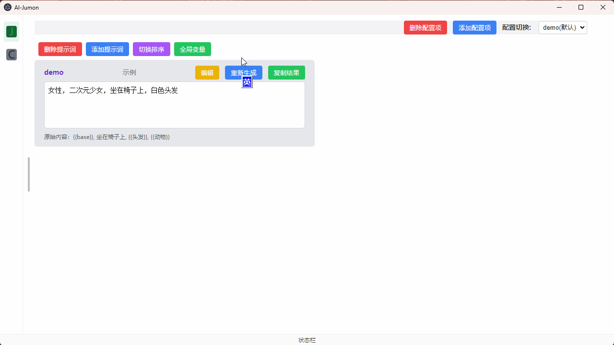

# AI-Jumon
AI 提示词管理及构建工具，注重碎片化拼接及复用。

## 效果演示

## 开发运行

建议使用 `pnpm`；

然后 electron 依赖无法安装的见：[附加说明](https://github.com/wdssmq/electron-demo/blob/main/note.md "note.md")，就是需要单独为其指定镜像源；

打包时需要的依赖下载也见上述说明；

----

前期研究怎么用的部分作为 demo 另开了个仓库，可以作为参考：

> wdssmq/electron-demo: 研究 electron 的使用和开发；
>
> [https://github.com/wdssmq/electron-demo](https://github.com/wdssmq/electron-demo "wdssmq/electron-demo: 研究 electron 的使用和开发；")

## 其他

数据文件在 `%APPDATA%\AI-Jumon\ai-data` 目录下；

## 投喂支持

爱发电：[https://afdian.com/a/wdssmq](https://afdian.com/a/wdssmq "沉冰浮水正在创作和 z-blog 相关或无关的各种有用或没用的代码 | 爱发电")

哔哩哔哩：[https://space.bilibili.com/44744006](https://space.bilibili.com/44744006 "沉冰浮水的个人空间\_哔哩哔哩\_bilibili")「投币或充电」「[大会员卡券领取 - bilibili](https://account.bilibili.com/account/big/myPackage "大会员卡券领取 - bilibili")」

RSS 订阅：[https://feed.wdssmq.com](https://feed.wdssmq.com "沉冰浮水博客的 RSS 订阅地址") 「[「言说」RSS 是一种态度！！](https://www.wdssmq.com/post/20201231613.html "「言说」RSS 是一种态度！！")」

在更多平台关注我：[https://www.wdssmq.com/guestbook.html#其他出没站点和信息](https://www.wdssmq.com/guestbook.html#%E5%85%B6%E4%BB%96%E5%87%BA%E6%B2%A1%E5%9C%B0%E7%82%B9%E5%92%8C%E4%BF%A1%E6%81%AF "在更多平台关注我")

更多「小代码」：[https://cn.bing.com/search?q=小代码+沉冰浮水](https://cn.bing.com/search?q=%E5%B0%8F%E4%BB%A3%E7%A0%81+%E6%B2%89%E5%86%B0%E6%B5%AE%E6%B0%B4 "小代码 沉冰浮水 - 必应搜索")

<!-- ##################################### -->
